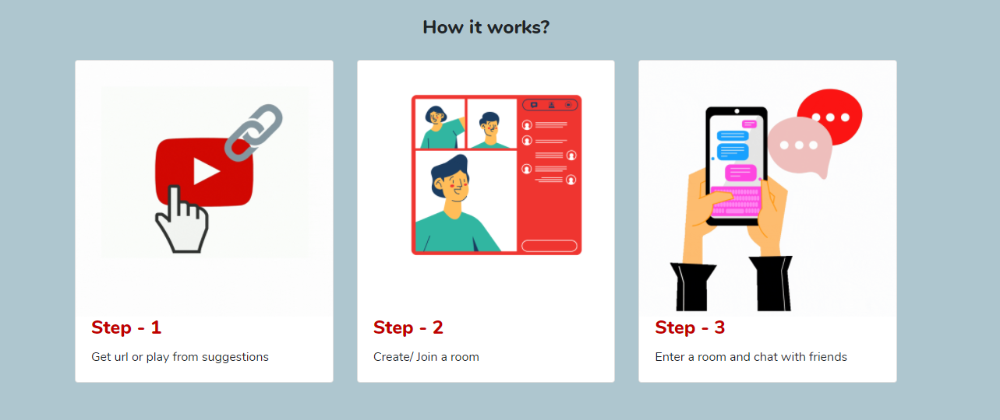

**Stream4All** is a platform for streaming content(a video in any format. eg: a drive link, a youtube video or a video from your PC) live with a group of friends.

Check it out at https://stream4all.netlify.app/ 😁✨

This is a video demonstration to guide you through the working : https://www.youtube.com/watch?v=LsNlE7k5v54

### Results
This was a submission to the event Webathon conducted by PES University, Bangalore.
We received an honourable mention for this project among the 50+ teams that participated

### Future
- Integration can be done with music APIs such as Spotify
- This can also be extended to a peer study platform

### Contributors

<table>
  <tr>
     <td align="center"><a href="https://github.com/Pranathi-star"> <b>Pranathi Kodicherla</b></a></td>
      <td align="center"><a href="https://github.com/FaryalAjradh"> <b>Fariyal Ajrad</b></a></td>
      <td align="center"><a href="https://github.com/Manognya5"> <b>Manognya S</b></a></td>
      <td align="center"><a href="https://github.com/Namyalg"> <b>Namya LG</b></a></td>
   
  </tr>
  </table>
